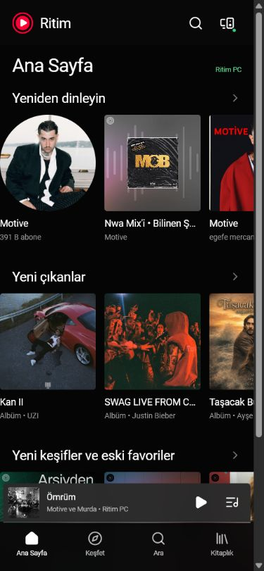
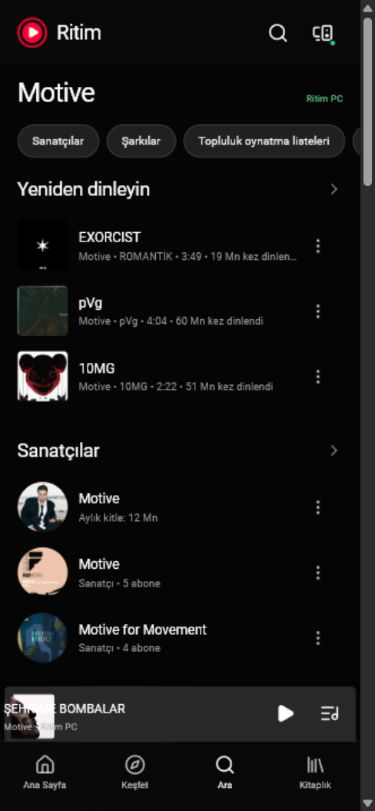
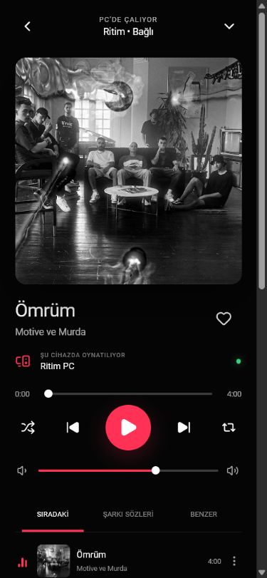

# Ritim

  

<strong>YouTube Music on your PC, controlled from a real Android companion.</strong>

  <a href="docs/README.tr.md">Türkçe</a> ·
  <a href="docs/README.en.md">English</a> ·
  <a href="../../releases/latest">İndir / Download</a>

  
  
  
  

Ritim runs the official YouTube Music website in a dedicated Windows desktop app and turns its Android app into a low-latency remote. Your recommendations, searches, artists, albums, library, queue and playback state come from the YouTube Music session already open on the PC. Audio stays on the PC.

Ritim, resmi YouTube Music sitesini ayrı bir Windows masaüstü uygulamasında çalıştırır; Android uygulamasını ise düşük gecikmeli bir kumandaya dönüştürür. Öneriler, aramalar, sanatçılar, albümler, kitaplık, sıra ve oynatma durumu PC’de açık olan YouTube Music oturumundan gelir. Ses PC’de kalır.

  
  
  

## Highlights

- Official `music.youtube.com` experience on Windows with a persistent Google session.
- Native Android APK with in-app QR pairing—no browser tab required.
- Home, Explore, Search, Library, artist/album details, queue and playback controls on mobile.
- Secure local pairing token; Google cookies and passwords never leave the PC.
- Discord Rich Presence support.
- GitHub Releases update checks on desktop and Android.

## Quick start

1. Install the Windows package from [Releases](../../releases/latest) and open Ritim.
2. Sign in to YouTube Music in the desktop window.
3. Install the Android APK from the same release.
4. Open **Settings** on the PC, then scan its QR code from the Android app. Both devices must be on the same local network.

Development and architecture details are available in [Türkçe](docs/README.tr.md) and [English](docs/README.en.md).

> Ritim is an independent project and is not affiliated with, endorsed by, or sponsored by Google or YouTube. YouTube and YouTube Music are trademarks of Google LLC.
